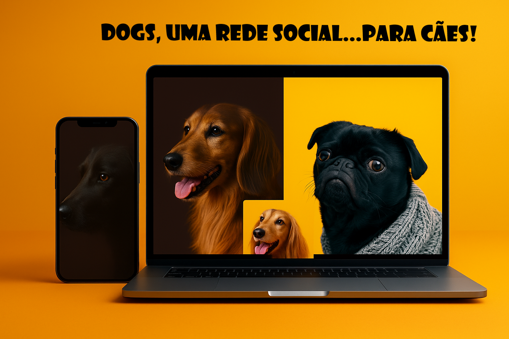

# DOGs, uma rede social para cães 🐾

Um projeto moderno e divertido que transforma a experiência de tutores e pets em uma rede social visualmente envolvente. DOGs é uma plataforma pensada para conectar apaixonados por cães, permitindo o compartilhamento de fotos, perfis e momentos especiais de forma simples e intuitiva.

O design foi desenvolvido com inspiração em redes sociais contemporâneas, equilibrando estética e funcionalidade. A interface combina tons vibrantes de amarelo com contrastes em preto e marrom, transmitindo energia e elegância. O resultado é uma identidade visual marcante, que dá destaque absoluto às fotos dos cães.

## 📦 Tecnologias usadas:

- 
- 
- 
- 

# Link

- https://projeto-dogs-sooty.vercel.app/

## 👷 Autores

- **AbediasLOR** - _Autor do projeto_

## 💡 Expressões de gratidão

- Projeto desenvolvido durante o curso de REACT da Origamid.

## Meu Linkedin!

- 
